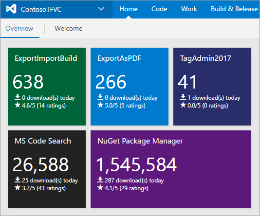
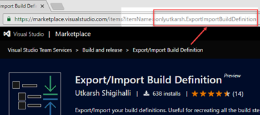
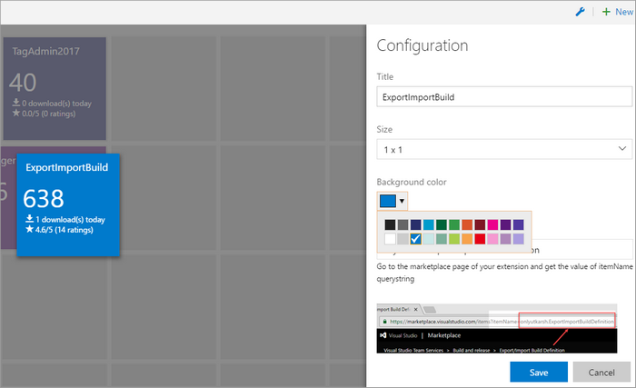

## Get Started ##

This dashboard widget allows you to track your extension's downloads, ratings and downloads/day right from the VSTS/TFS dashboard!

[**Download from VS Marketplace**](https://marketplace.visualstudio.com/items?itemName=onlyutkarsh.extensiondownloadmonitor)

**Features**
- Track downloads/ratings of any extension - Visual Studio, VSTS/TFS extensions, and also Visual Studio Code extensions.
- Know how many users downloaded your extension today.
- Track the average rating and along with total number of ratings your extension has received.

### Add to Dashboard ###

1. Follow the steps explained [here](https://www.visualstudio.com/en-us/docs/report/dashboards#add-a-widget) and select `Extension Download Monitor` widget.

### Configuration ###

1. Browse to extension page in Visual Studio Marketplace.
2. Look for `itemName=value` in the url as highlighted in screenshot below.

    

3. Get the `itemname` for your extension. For example item name is  `onlyutkarsh.ExportImportBuildDefinition` in the above screenshot.
4. Paste that in the `Item Name` text box in the configuration.

#### Other Options ####

1. The extension supports 2 sizes (1x1 and 2x1).
2. You can also select color for the widget from various available colors.

### Report Issues ###
Found an issue or want to suggest a feature? Add them at 	[here](http://github.com/onlyutkarsh/extensiondownloadmonitorwidget).
